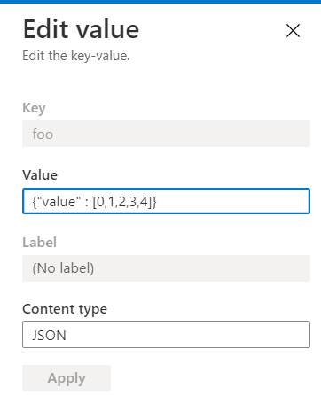

Demo of a simple .net core console app that reads a json string from Azure App Configuration service and parses that json into an int array. 

Used this as a starting point: https://docs.microsoft.com/en-us/azure/azure-app-configuration/quickstart-dotnet-core-app

Reference to JSON serialization / deserialization using System.Text.Json in .NET Core: https://docs.microsoft.com/en-us/dotnet/standard/serialization/system-text-json-how-to#how-to-read-json-into-net-objects-deserialize


```
rg: 'blizzappconfig2rg'
app config: 'fooconfig'
read-only access key conn string: 'xxxxxxxxxxxx'
export ConnectionString='Endpoint=xxxxxxxxxxxx'
```

In App Configuration service

- The Key name is: foo
-  The json string in App Configuration service looks like this: {"value" : [0,1,2,3,4]}
- I set the Content type to JSON, but that isn't required.

    

### The output from the program is: 

```
this is a test: {"value" : [0,1,2,3,4]}
element is: 0
element is: 1
element is: 2
element is: 3
element is: 4
```